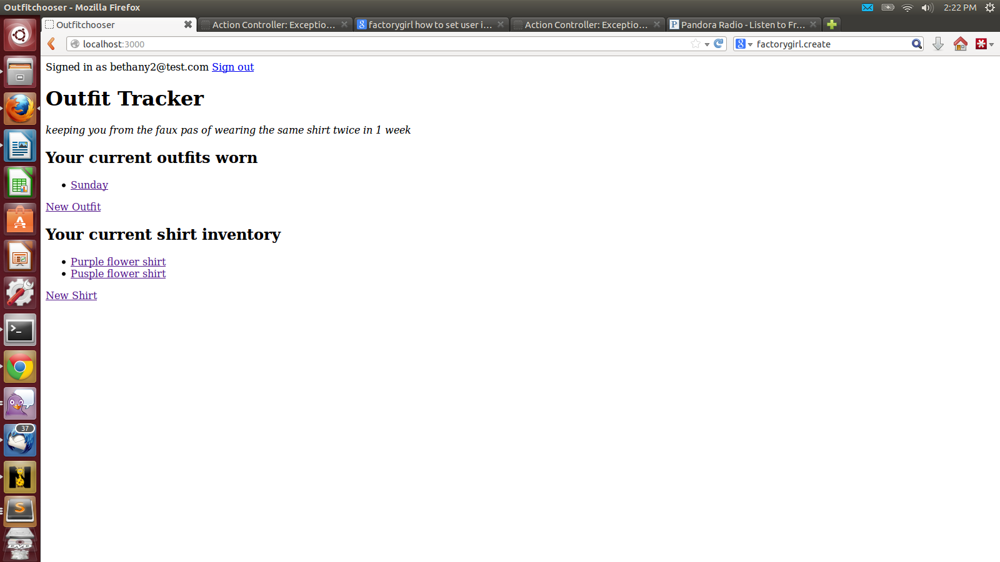

#Outfit Chooser
This application is an app a day assignment for Code Fellows Silver Bootcamp.

This application allows a user to create an inventory of shirts & pants and keep track of which outfits they wear on which days.

The shirts are common across all users, but each user has their own outfits that they wear.

#License
[http://bethanyr.mit-license.org/](http://bethanyr.mit-license.org/)
